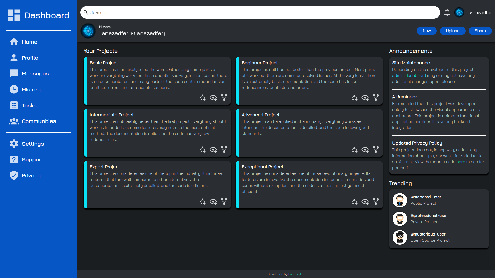

# admin-dashboard
__admin-dashboard__ is a personal project developed as part of the [__Intermediate HTML and CSS__](https://www.theodinproject.com/lessons/node-path-intermediate-html-and-css-admin-dashboard) course from [__The Odin Project__](https://www.theodinproject.com).

### This personal project was undertaken to learn and practice the following:
* Grid Layout
* HTML Semantics

## Features
* Interactive User Interface
* Responsive Web Design

## Preview

  
  <a href="https://lanezedfer.github.io/admin-dashboard/">Link to Live Preview</a>

# Acknowledgements
### Course:
* [__The Odin Project__](https://www.theodinproject.com/about)

### Font Used:
* [__Jura__](https://fonts.google.com/specimen/Jura/about)

### Icons Used:
* __Profile Avatars__: [sp-studio.de](https://www.sp-studio.de)
* __SVG Icons__: [Pictogrammers](https://pictogrammers.com)

# License
This project is distributed under the MIT License. View [`LICENSE.txt`](LICENSE.txt) for more information.

# Author
* Lance Ezeckel P. Fernando (fernando.lance.eze@gmail.com)